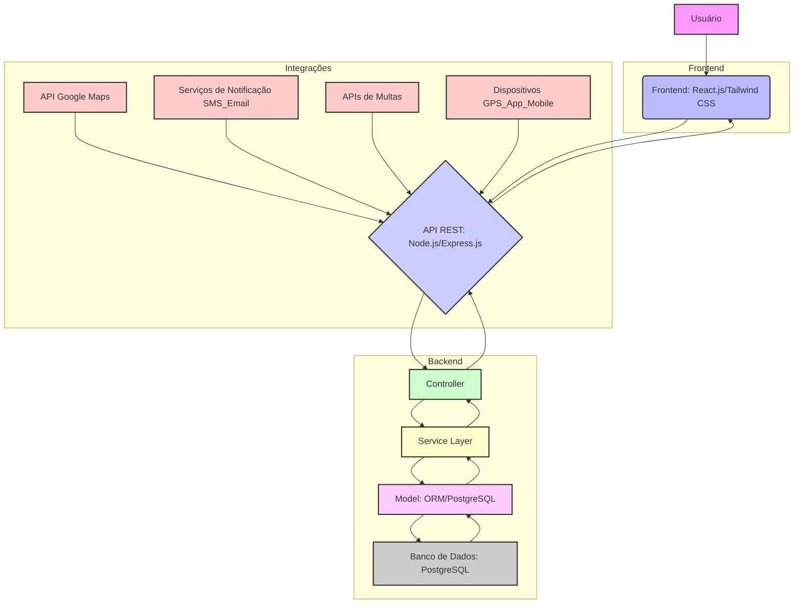

# Análise de Requisitos e Planejamento da Arquitetura

## Contexto do Projeto

O objetivo é desenvolver um sistema web completo para controle de frota veicular para a Secretaria de Saúde de Irecê-BA. O sistema deve aprimorar a solução existente, adicionando funcionalidades avançadas e módulos novos.

## Requisitos Técnicos

*   **Arquitetura:** MVC (Model-View-Controller)
*   **Acesso:** Online e responsivo
*   **Banco de Dados:** Relacional
*   **Integrações:** API REST
*   **Interface:** Moderna e intuitiva

## Funcionalidades Principais

### Módulo de Combustível

*   Registro de abastecimentos (data, valor, litros, posto)
*   Cálculo automático de consumo (km/l)
*   Relatórios de custo por veículo/período
*   Alertas de consumo fora da média
*   Controle de tanque cheio/parcial

### Dashboard Avançado

*   Mapas interativos com localização dos veículos
*   Gráficos em tempo real de utilização
*   Métricas de custo operacional por km
*   Alertas inteligentes de manutenção
*   KPIs de eficiência da frota

### Rastreamento GPS

*   Integração com dispositivos GPS ou app mobile
*   Visualização em tempo real no mapa
*   Histórico de rotas e trajetos
*   Relatórios de tempo de utilização
*   Geofencing com áreas permitidas

### Módulos Existentes (Evolução)

*   Controle de veículos (dados completos)
*   Gestão de motoristas
*   Registros de utilização
*   Controle de manutenções
*   Relatórios personalizados
*   Backup e restauração

### Novos Módulos

*   Controle de documentação (seguros, licenciamento)
*   Gestão de multas e infrações
*   Ordens de serviço para manutenção
*   App mobile para motoristas
*   Notificações push e por email

## Tecnologias Sugeridas

### Backend

*   **Framework:** Node.js + Express.js ou PHP Laravel
*   **Banco de Dados:** PostgreSQL ou MySQL
*   **Autenticação:** JWT
*   **API:** RESTful

### Frontend

*   **Framework:** React.js ou Vue.js
*   **CSS Framework:** Bootstrap ou Tailwind CSS
*   **Gráficos:** Chart.js
*   **Mapas:** Leaflet ou Google Maps

### Integrações

*   API Google Maps ou OpenStreetMap
*   Serviços de SMS/Email para notificações
*   APIs de consulta de multas (quando disponível)

## Entregáveis Esperados

1.  **Plano de Desenvolvimento:** Diagrama de arquitetura MVC, modelagem do banco de dados, cronograma de implementação.
2.  **Protótipo:** Wireframes das principais telas, diagrama de navegação, design system básico.
3.  **Documentação:** Especificação técnica, manual de instalação, guia do usuário.

## Premissas

*   Escalabilidade
*   Código bem documentado
*   Interface responsiva
*   Segurança de dados
*   Fácil manutenção

## Diferenciais Desejados

*   Relatórios exportáveis em PDF/Excel
*   Sistema de notificações inteligentes
*   Análise preditiva para manutenções
*   Controle de custos detalhado
*   Multi-tenancy (se necessário)

## Escolha de Tecnologias (Proposta Inicial)

Considerando os requisitos e as sugestões, propõe-se a seguinte pilha tecnológica para o desenvolvimento:

*   **Backend:** Node.js com Express.js (pela flexibilidade e ecossistema JavaScript, que pode ser compartilhado com o frontend).
*   **Banco de Dados:** PostgreSQL (pela robustez, escalabilidade e suporte a funcionalidades avançadas).
*   **Frontend:** React.js (pela popularidade, grande comunidade e capacidade de construir SPAs complexas e responsivas).
*   **CSS Framework:** Tailwind CSS (pela flexibilidade e otimização do desenvolvimento de interfaces personalizadas).
*   **Gráficos:** Chart.js (já sugerido e amplamente utilizado).
*   **Mapas:** Google Maps API (pela riqueza de recursos e precisão, embora OpenStreetMap seja uma alternativa viável se houver restrições de custo).
*   **Autenticação:** JWT (conforme sugerido).
*   **Integrações:** Serviços de SMS/Email (a serem definidos conforme provedor) e APIs de multas (a serem pesquisadas).

## Diagrama de Arquitetura MVC

