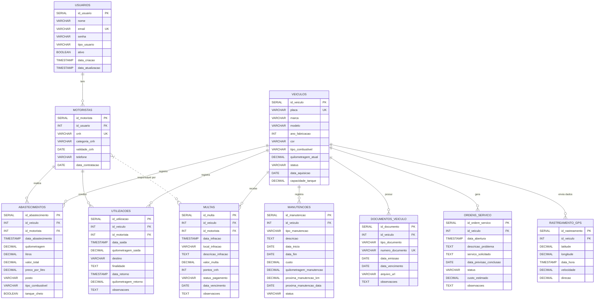

# Modelagem do Banco de Dados

Este documento detalha a modelagem do banco de dados relacional para o sistema de controle de frota, utilizando PostgreSQL como base. As tabelas e seus relacionamentos foram projetados para suportar todas as funcionalidades principais e módulos existentes/novos, garantindo escalabilidade e integridade dos dados.

## Diagrama Entidade-Relacionamento (DER)

Será gerado um DER visual para complementar esta seção.

## Tabelas e Atributos

### 1. `usuarios`

Gerencia os usuários do sistema, incluindo motoristas e administradores.

| Atributo        | Tipo de Dado      | Restrições           | Descrição                               |
| :-------------- | :---------------- | :------------------- | :-------------------------------------- |
| `id_usuario`    | `SERIAL`          | `PRIMARY KEY`        | Identificador único do usuário.         |
| `nome`          | `VARCHAR(255)`    | `NOT NULL`           | Nome completo do usuário.               |
| `email`         | `VARCHAR(255)`    | `NOT NULL`, `UNIQUE` | Endereço de e-mail do usuário (login).  |
| `senha`         | `VARCHAR(255)`    | `NOT NULL`           | Senha hash do usuário.                  |
| `tipo_usuario`  | `VARCHAR(50)`     | `NOT NULL`           | Ex: 'motorista', 'administrador', 'gestor'. |
| `ativo`         | `BOOLEAN`         | `DEFAULT TRUE`       | Indica se o usuário está ativo.         |
| `data_criacao`  | `TIMESTAMP`       | `DEFAULT NOW()`      | Data e hora de criação do registro.     |
| `data_atualizacao` | `TIMESTAMP`    | `DEFAULT NOW()`      | Última atualização do registro.         |

### 2. `motoristas`

Informações específicas dos motoristas, com ligação à tabela `usuarios`.

| Atributo        | Tipo de Dado      | Restrições           | Descrição                               |
| :-------------- | :---------------- | :------------------- | :-------------------------------------- |
| `id_motorista`  | `SERIAL`          | `PRIMARY KEY`        | Identificador único do motorista.       |
| `id_usuario`    | `INT`             | `NOT NULL`, `UNIQUE`, `FOREIGN KEY (usuarios)` | Chave estrangeira para `usuarios`.      |
| `cnh`           | `VARCHAR(20)`     | `NOT NULL`, `UNIQUE` | Número da CNH.                          |
| `categoria_cnh` | `VARCHAR(10)`     | `NOT NULL`           | Categoria da CNH (Ex: 'B', 'C', 'D', 'E'). |
| `validade_cnh`  | `DATE`            | `NOT NULL`           | Data de validade da CNH.                |
| `telefone`      | `VARCHAR(20)`     | `NULLABLE`           | Telefone de contato do motorista.       |
| `data_contratacao` | `DATE`         | `NULLABLE`           | Data de contratação do motorista.       |

### 3. `veiculos`

Informações detalhadas sobre cada veículo da frota.

| Atributo        | Tipo de Dado      | Restrições           | Descrição                               |
| :-------------- | :---------------- | :------------------- | :-------------------------------------- |
| `id_veiculo`    | `SERIAL`          | `PRIMARY KEY`        | Identificador único do veículo.         |
| `placa`         | `VARCHAR(10)`     | `NOT NULL`, `UNIQUE` | Placa do veículo.                       |
| `marca`         | `VARCHAR(100)`    | `NOT NULL`           | Marca do veículo.                       |
| `modelo`        | `VARCHAR(100)`    | `NOT NULL`           | Modelo do veículo.                      |
| `ano_fabricacao`| `INT`             | `NOT NULL`           | Ano de fabricação.                      |
| `cor`           | `VARCHAR(50)`     | `NULLABLE`           | Cor do veículo.                         |
| `tipo_combustivel` | `VARCHAR(50)`  | `NOT NULL`           | Ex: 'Gasolina', 'Etanol', 'Diesel', 'Flex'. |
| `quilometragem_atual` | `DECIMAL(10,2)` | `DEFAULT 0.00`       | Quilometragem atual do veículo.         |
| `status`        | `VARCHAR(50)`     | `DEFAULT 'Disponível'` | Ex: 'Disponível', 'Em Uso', 'Manutenção', 'Inativo'. |
| `data_aquisicao`| `DATE`            | `NULLABLE`           | Data de aquisição do veículo.           |
| `capacidade_tanque` | `DECIMAL(5,2)` | `NULLABLE`           | Capacidade do tanque em litros.         |

### 4. `abastecimentos`

Registros de todos os abastecimentos realizados.

| Atributo        | Tipo de Dado      | Restrições           | Descrição                               |
| :-------------- | :---------------- | :------------------- | :-------------------------------------- |
| `id_abastecimento` | `SERIAL`       | `PRIMARY KEY`        | Identificador único do abastecimento.   |
| `id_veiculo`    | `INT`             | `NOT NULL`, `FOREIGN KEY (veiculos)` | Chave estrangeira para `veiculos`.      |
| `id_motorista`  | `INT`             | `NOT NULL`, `FOREIGN KEY (motoristas)` | Chave estrangeira para `motoristas`.    |
| `data_abastecimento` | `TIMESTAMP`    | `NOT NULL`           | Data e hora do abastecimento.           |
| `quilometragem` | `DECIMAL(10,2)`   | `NOT NULL`           | Quilometragem do veículo no abastecimento. |
| `litros`        | `DECIMAL(7,2)`    | `NOT NULL`           | Quantidade de litros abastecidos.       |
| `valor_total`   | `DECIMAL(7,2)`    | `NOT NULL`           | Valor total do abastecimento.           |
| `preco_por_litro` | `DECIMAL(5,2)` | `NOT NULL`           | Preço por litro do combustível.         |
| `posto`         | `VARCHAR(255)`    | `NULLABLE`           | Nome do posto de combustível.           |
| `tipo_combustivel` | `VARCHAR(50)`  | `NOT NULL`           | Tipo de combustível abastecido.         |
| `tanque_cheio`  | `BOOLEAN`         | `DEFAULT FALSE`      | Indica se o tanque foi completamente cheio. |

### 5. `utilizacoes`

Registros de uso dos veículos (viagens, deslocamentos).

| Atributo        | Tipo de Dado      | Restrições           | Descrição                               |
| :-------------- | :---------------- | :------------------- | :-------------------------------------- |
| `id_utilizacao` | `SERIAL`          | `PRIMARY KEY`        | Identificador único da utilização.      |
| `id_veiculo`    | `INT`             | `NOT NULL`, `FOREIGN KEY (veiculos)` | Chave estrangeira para `veiculos`.      |
| `id_motorista`  | `INT`             | `NOT NULL`, `FOREIGN KEY (motoristas)` | Chave estrangeira para `motoristas`.    |
| `data_saida`    | `TIMESTAMP`       | `NOT NULL`           | Data e hora de saída.                   |
| `quilometragem_saida` | `DECIMAL(10,2)` | `NOT NULL`           | Quilometragem no início da utilização.  |
| `destino`       | `VARCHAR(255)`    | `NOT NULL`           | Destino da viagem.                      |
| `finalidade`    | `TEXT`            | `NULLABLE`           | Descrição da finalidade da viagem.      |
| `data_retorno`  | `TIMESTAMP`       | `NULLABLE`           | Data e hora de retorno.                 |
| `quilometragem_retorno` | `DECIMAL(10,2)` | `NULLABLE`           | Quilometragem no fim da utilização.     |
| `observacoes`   | `TEXT`            | `NULLABLE`           | Observações adicionais.                 |

### 6. `manutencoes`

Registros de manutenções preventivas e corretivas.

| Atributo        | Tipo de Dado      | Restrições           | Descrição                               |
| :-------------- | :---------------- | :------------------- | :-------------------------------------- |
| `id_manutencao` | `SERIAL`          | `PRIMARY KEY`        | Identificador único da manutenção.      |
| `id_veiculo`    | `INT`             | `NOT NULL`, `FOREIGN KEY (veiculos)` | Chave estrangeira para `veiculos`.      |
| `tipo_manutencao` | `VARCHAR(100)`  | `NOT NULL`           | Ex: 'Preventiva', 'Corretiva', 'Revisão'. |
| `descricao`     | `TEXT`            | `NOT NULL`           | Detalhes da manutenção.                 |
| `data_inicio`   | `DATE`            | `NOT NULL`           | Data de início da manutenção.           |
| `data_fim`      | `DATE`            | `NULLABLE`           | Data de término da manutenção.          |
| `custo`         | `DECIMAL(10,2)`   | `NULLABLE`           | Custo total da manutenção.              |
| `quilometragem_manutencao` | `DECIMAL(10,2)` | `NULLABLE`           | Quilometragem do veículo na manutenção. |
| `proxima_manutencao_km` | `DECIMAL(10,2)` | `NULLABLE`           | Quilometragem prevista para a próxima manutenção. |
| `proxima_manutencao_data` | `DATE`      | `NULLABLE`           | Data prevista para a próxima manutenção. |
| `status`        | `VARCHAR(50)`     | `DEFAULT 'Pendente'` | Ex: 'Pendente', 'Em Andamento', 'Concluída', 'Cancelada'. |

### 7. `documentos_veiculo`

Controle de documentação dos veículos (seguros, licenciamento).

| Atributo        | Tipo de Dado      | Restrições           | Descrição                               |
| :-------------- | :---------------- | :------------------- | :-------------------------------------- |
| `id_documento`  | `SERIAL`          | `PRIMARY KEY`        | Identificador único do documento.       |
| `id_veiculo`    | `INT`             | `NOT NULL`, `FOREIGN KEY (veiculos)` | Chave estrangeira para `veiculos`.      |
| `tipo_documento`| `VARCHAR(100)`    | `NOT NULL`           | Ex: 'Licenciamento', 'Seguro', 'IPVA'.  |
| `numero_documento` | `VARCHAR(255)` | `NOT NULL`, `UNIQUE` | Número do documento.                    |
| `data_emissao`  | `DATE`            | `NULLABLE`           | Data de emissão do documento.           |
| `data_vencimento` | `DATE`          | `NOT NULL`           | Data de vencimento do documento.        |
| `arquivo_url`   | `VARCHAR(255)`    | `NULLABLE`           | URL para o arquivo digitalizado.        |
| `observacoes`   | `TEXT`            | `NULLABLE`           | Observações adicionais.                 |

### 8. `multas`

Gestão de multas e infrações.

| Atributo        | Tipo de Dado      | Restrições           | Descrição                               |
| :-------------- | :---------------- | :------------------- | :-------------------------------------- |
| `id_multa`      | `SERIAL`          | `PRIMARY KEY`        | Identificador único da multa.           |
| `id_veiculo`    | `INT`             | `NOT NULL`, `FOREIGN KEY (veiculos)` | Chave estrangeira para `veiculos`.      |
| `id_motorista`  | `INT`             | `NULLABLE`, `FOREIGN KEY (motoristas)` | Motorista responsável pela multa (se aplicável). |
| `data_infracao` | `TIMESTAMP`       | `NOT NULL`           | Data e hora da infração.                |
| `local_infracao`| `VARCHAR(255)`    | `NULLABLE`           | Local onde a infração ocorreu.          |
| `descricao_infracao` | `TEXT`       | `NOT NULL`           | Descrição detalhada da infração.        |
| `valor_multa`   | `DECIMAL(10,2)`   | `NOT NULL`           | Valor da multa.                         |
| `pontos_cnh`    | `INT`             | `NULLABLE`           | Pontos adicionados à CNH do motorista.  |
| `status_pagamento` | `VARCHAR(50)`  | `DEFAULT 'Pendente'` | Ex: 'Pendente', 'Paga', 'Recorrida'.    |
| `data_vencimento` | `DATE`          | `NULLABLE`           | Data de vencimento para pagamento.      |
| `observacoes`   | `TEXT`            | `NULLABLE`           | Observações adicionais.                 |

### 9. `ordens_servico`

Ordens de serviço para manutenções.

| Atributo        | Tipo de Dado      | Restrições           | Descrição                               |
| :-------------- | :---------------- | :------------------- | :-------------------------------------- |
| `id_ordem_servico` | `SERIAL`       | `PRIMARY KEY`        | Identificador único da ordem de serviço. |
| `id_veiculo`    | `INT`             | `NOT NULL`, `FOREIGN KEY (veiculos)` | Chave estrangeira para `veiculos`.      |
| `data_abertura` | `TIMESTAMP`       | `NOT NULL`           | Data e hora de abertura da OS.          |
| `descricao_problema` | `TEXT`       | `NOT NULL`           | Descrição do problema relatado.         |
| `servico_solicitado` | `TEXT`       | `NULLABLE`           | Serviço solicitado.                     |
| `data_previsao_conclusao` | `DATE`   | `NULLABLE`           | Data prevista para conclusão.           |
| `status`        | `VARCHAR(50)`     | `DEFAULT 'Aberta'`   | Ex: 'Aberta', 'Em Andamento', 'Concluída', 'Cancelada'. |
| `custo_estimado`| `DECIMAL(10,2)`   | `NULLABLE`           | Custo estimado da OS.                   |
| `observacoes`   | `TEXT`            | `NULLABLE`           | Observações adicionais.                 |

### 10. `rastreamento_gps`

Dados de rastreamento GPS dos veículos.

| Atributo        | Tipo de Dado      | Restrições           | Descrição                               |
| :-------------- | :---------------- | :------------------- | :-------------------------------------- |
| `id_rastreamento` | `SERIAL`       | `PRIMARY KEY`        | Identificador único do registro de rastreamento. |
| `id_veiculo`    | `INT`             | `NOT NULL`, `FOREIGN KEY (veiculos)` | Chave estrangeira para `veiculos`.      |
| `latitude`      | `DECIMAL(9,6)`    | `NOT NULL`           | Latitude da localização.                |
| `longitude`     | `DECIMAL(9,6)`    | `NOT NULL`           | Longitude da localização.               |
| `data_hora`     | `TIMESTAMP`       | `NOT NULL`           | Data e hora da leitura do GPS.          |
| `velocidade`    | `DECIMAL(5,2)`    | `NULLABLE`           | Velocidade do veículo no momento.       |
| `direcao`       | `DECIMAL(5,2)`    | `NULLABLE`           | Direção do veículo em graus.            |

## Relacionamentos

*   `motoristas` **1:1** `usuarios` (via `id_usuario`)
*   `abastecimentos` **N:1** `veiculos` (via `id_veiculo`)
*   `abastecimentos` **N:1** `motoristas` (via `id_motorista`)
*   `utilizacoes` **N:1** `veiculos` (via `id_veiculo`)
*   `utilizacoes` **N:1** `motoristas` (via `id_motorista`)
*   `manutencoes` **N:1** `veiculos` (via `id_veiculo`)
*   `documentos_veiculo` **N:1** `veiculos` (via `id_veiculo`)
*   `multas` **N:1** `veiculos` (via `id_veiculo`)
*   `multas` **N:1** `motoristas` (via `id_motorista`, opcional)
*   `ordens_servico` **N:1** `veiculos` (via `id_veiculo`)
*   `rastreamento_gps` **N:1** `veiculos` (via `id_veiculo`)

## Índices

Serão criados índices para as chaves primárias e estrangeiras, além de campos frequentemente utilizados em consultas (ex: `email` em `usuarios`, `placa` em `veiculos`, `data_abastecimento` em `abastecimentos`).

## Considerações de Escalabilidade

*   **Particionamento:** Para tabelas com grande volume de dados (ex: `rastreamento_gps`, `abastecimentos`, `utilizacoes`), pode-se considerar o particionamento por data para melhorar o desempenho de consultas e manutenção.
*   **Replicação:** Para alta disponibilidade e balanceamento de carga, a replicação do PostgreSQL pode ser configurada.
*   **Otimização de Consultas:** Uso de `EXPLAIN ANALYZE` para otimizar consultas complexas e garantir o uso eficiente dos índices.

## Segurança

*   **Senhas:** Armazenadas como hashes (ex: bcrypt) na tabela `usuarios`.
*   **Permissões:** Implementação de controle de acesso baseado em papéis (RBAC) no nível da aplicação, utilizando o campo `tipo_usuario`.
*   **Conexões:** Utilização de SSL para conexões com o banco de dados.

## Diagrama Entidade-Relacionamento (DER)

