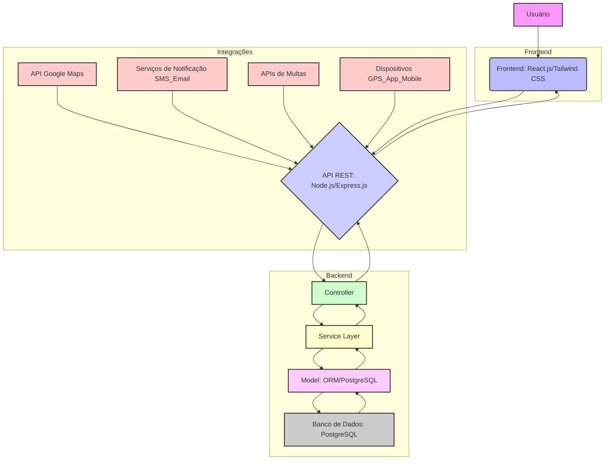
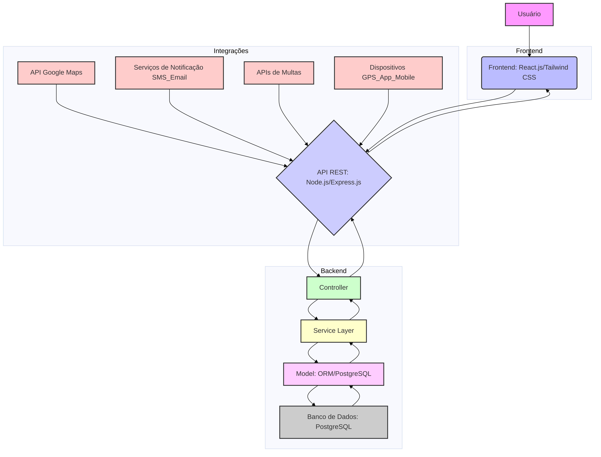
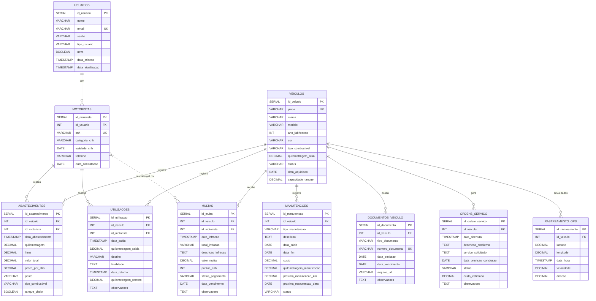
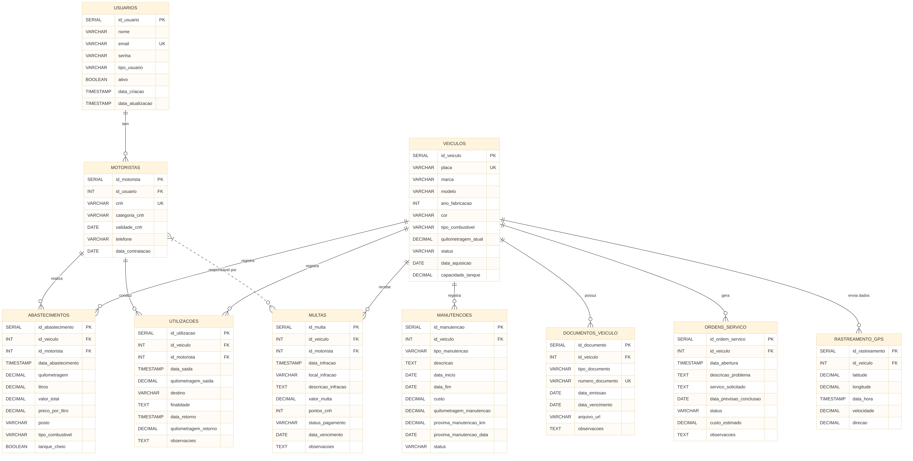

# Especificação Técnica do Sistema de Controle de Frota

Este documento detalha a especificação técnica para o desenvolvimento de um sistema web completo de controle de frota veicular para a Secretaria de Saúde de Irecê-BA. Ele abrange a análise de requisitos, a arquitetura MVC, a modelagem do banco de dados e a estrutura inicial do backend.

## 1. Análise de Requisitos e Planejamento da Arquitetura

### 1.1. Contexto do Projeto

O objetivo principal é desenvolver um sistema web robusto e escalável para gerenciar a frota de veículos da Secretaria de Saúde de Irecê-BA. A solução visa modernizar e expandir as funcionalidades existentes, incorporando recursos avançados de controle de combustível, um dashboard interativo e rastreamento GPS em tempo real.

### 1.2. Requisitos Técnicos

O sistema será construído com base nos seguintes requisitos técnicos:

*   **Arquitetura:** Será adotado o padrão Model-View-Controller (MVC) para garantir a separação de responsabilidades, modularidade e facilidade de manutenção.
*   **Acesso:** O sistema será online e totalmente responsivo, adaptando-se a diferentes dispositivos (desktops, tablets e smartphones).
*   **Banco de Dados:** Será utilizado um banco de dados relacional para armazenamento persistente dos dados, priorizando a integridade e a consistência.
*   **Integrações:** Uma API RESTful será desenvolvida para permitir a integração com outros sistemas e serviços externos.
*   **Interface:** A interface do usuário será moderna, intuitiva e de fácil usabilidade, visando otimizar a experiência do usuário.

### 1.3. Funcionalidades Principais

O sistema contemplará as seguintes funcionalidades, divididas em módulos:

#### 1.3.1. Módulo de Combustível

*   **Registro de Abastecimentos:** Cadastro detalhado de data, valor, litros e posto de abastecimento.
*   **Cálculo de Consumo:** Cálculo automático do consumo de combustível (km/l) por veículo.
*   **Relatórios de Custo:** Geração de relatórios de custo por veículo e por período.
*   **Alertas de Consumo:** Notificações para consumo de combustível fora da média esperada.
*   **Controle de Tanque:** Registro de abastecimentos com tanque cheio ou parcial.

#### 1.3.2. Dashboard Avançado

*   **Mapas Interativos:** Visualização da localização dos veículos em mapas interativos.
*   **Gráficos em Tempo Real:** Apresentação de gráficos de utilização da frota em tempo real.
*   **Métricas de Custo:** Exibição de métricas de custo operacional por quilômetro rodado.
*   **Alertas de Manutenção:** Notificações inteligentes sobre manutenções pendentes ou programadas.
*   **KPIs de Eficiência:** Indicadores Chave de Performance (KPIs) para avaliar a eficiência da frota.

#### 1.3.3. Rastreamento GPS

*   **Integração:** Conexão com dispositivos GPS ou aplicativos móveis para coleta de dados.
*   **Visualização em Mapa:** Exibição da posição dos veículos em tempo real no mapa.
*   **Histórico de Rotas:** Armazenamento e visualização do histórico de rotas e trajetos percorridos.
*   **Relatórios de Utilização:** Geração de relatórios sobre o tempo de utilização dos veículos.
*   **Geofencing:** Definição de áreas permitidas e alertas para entrada/saída dessas áreas.

#### 1.3.4. Módulos Existentes (Evolução)

*   **Controle de Veículos:** Gerenciamento completo de dados dos veículos (cadastro, edição, exclusão).
*   **Gestão de Motoristas:** Cadastro e controle de informações dos motoristas.
*   **Registros de Utilização:** Acompanhamento do uso dos veículos.
*   **Controle de Manutenções:** Registro e agendamento de manutenções.
*   **Relatórios Personalizados:** Geração de relatórios customizáveis.
*   **Backup e Restauração:** Funcionalidades para backup e restauração de dados.

#### 1.3.5. Novos Módulos

*   **Controle de Documentação:** Gestão de seguros, licenciamentos e outros documentos veiculares.
*   **Gestão de Multas e Infrações:** Registro e acompanhamento de multas e infrações.
*   **Ordens de Serviço:** Criação e gerenciamento de ordens de serviço para manutenção.
*   **Aplicativo Mobile para Motoristas:** Desenvolvimento de um aplicativo complementar para motoristas.
*   **Notificações:** Sistema de notificações push e por e-mail.

### 1.4. Tecnologias Sugeridas e Escolha

As seguintes tecnologias foram sugeridas e a escolha inicial foi realizada para o desenvolvimento:

| Camada     | Sugestões                      | Escolha Proposta             | Justificativa                                                                                             |
| :--------- | :----------------------------- | :--------------------------- | :-------------------------------------------------------------------------------------------------------- |
| **Backend**| Node.js + Express.js ou PHP Laravel | **Node.js com Express.js**   | Flexibilidade, ecossistema JavaScript unificado com o frontend, alta performance para APIs.               |
| **Banco de Dados**| PostgreSQL ou MySQL            | **PostgreSQL**               | Robustez, escalabilidade, suporte a funcionalidades avançadas, integridade transacional.                 |
| **Frontend**| React.js ou Vue.js             | **React.js**                 | Popularidade, grande comunidade, capacidade de construir Single Page Applications (SPAs) complexas e responsivas. |
| **CSS Framework**| Bootstrap ou Tailwind CSS      | **Tailwind CSS**             | Flexibilidade, otimização do desenvolvimento de interfaces personalizadas, classes utilitárias.           |
| **Gráficos**| Chart.js                       | **Chart.js**                 | Já sugerido, amplamente utilizado, fácil integração com React para visualização de dados.                 |
| **Mapas**  | API Google Maps ou OpenStreetMap | **Google Maps API**          | Riqueza de recursos, precisão e funcionalidades avançadas de geolocalização.                              |
| **Autenticação**| JWT                            | **JWT (JSON Web Tokens)**    | Padrão de mercado para autenticação segura e escalável em APIs RESTful.                                   |
| **Integrações**| Serviços de SMS/Email, APIs de multas | **A definir (provedores)**   | Serão definidos provedores específicos para SMS/Email e pesquisadas APIs de multas conforme disponibilidade. |

### 1.5. Premissas e Diferenciais

**Premissas:**

*   **Escalabilidade:** O sistema será projetado para suportar um crescimento futuro no volume de dados e usuários.
*   **Código Documentado:** O código-fonte será bem documentado para facilitar a manutenção e futuras evoluções.
*   **Interface Responsiva:** A interface se adaptará a diferentes tamanhos de tela e dispositivos.
*   **Segurança de Dados:** Serão implementadas medidas de segurança robustas para proteger as informações sensíveis.
*   **Fácil Manutenção:** A arquitetura e o código serão estruturados para facilitar a manutenção e a correção de eventuais problemas.

**Diferenciais Desejados:**

*   **Relatórios Exportáveis:** Capacidade de exportar relatórios em formatos como PDF e Excel.
*   **Notificações Inteligentes:** Sistema de alertas e notificações proativas para eventos importantes.
*   **Análise Preditiva:** Implementação de análises preditivas para manutenções e consumo.
*   **Controle de Custos Detalhado:** Ferramentas para um controle financeiro minucioso da frota.
*   **Multi-tenancy:** Considerar a possibilidade de arquitetura multi-tenant para futuras expansões.

### 1.6. Diagrama de Arquitetura MVC

A arquitetura do sistema seguirá o padrão MVC, conforme ilustrado no diagrama abaixo:





## 2. Modelagem do Banco de Dados

Este seção detalha a modelagem do banco de dados relacional para o sistema de controle de frota, utilizando PostgreSQL como base. As tabelas e seus relacionamentos foram projetados para suportar todas as funcionalidades principais e módulos existentes/novos, garantindo escalabilidade e integridade dos dados.

### 2.1. Diagrama Entidade-Relacionamento (DER)

O DER abaixo ilustra as entidades e seus relacionamentos no banco de dados:





### 2.2. Tabelas e Atributos

#### 2.2.1. `usuarios`

Gerencia os usuários do sistema, incluindo motoristas e administradores.

| Atributo        | Tipo de Dado      | Restrições           | Descrição                               |
| :-------------- | :---------------- | :------------------- | :-------------------------------------- |
| `id_usuario`    | `SERIAL`          | `PRIMARY KEY`        | Identificador único do usuário.         |
| `nome`          | `VARCHAR(255)`    | `NOT NULL`           | Nome completo do usuário.               |
| `email`         | `VARCHAR(255)`    | `NOT NULL`, `UNIQUE` | Endereço de e-mail do usuário (login).  |
| `senha`         | `VARCHAR(255)`    | `NOT NULL`           | Senha hash do usuário.                  |
| `tipo_usuario`  | `VARCHAR(50)`     | `NOT NULL`           | Ex: 'motorista', 'administrador', 'gestor'. |
| `ativo`         | `BOOLEAN`         | `DEFAULT TRUE`       | Indica se o usuário está ativo.         |
| `data_criacao`  | `TIMESTAMP`       | `DEFAULT NOW()`      | Data e hora de criação do registro.     |
| `data_atualizacao` | `TIMESTAMP`    | `DEFAULT NOW()`      | Última atualização do registro.         |

#### 2.2.2. `motoristas`

Informações específicas dos motoristas, com ligação à tabela `usuarios`.

| Atributo        | Tipo de Dado      | Restrições           | Descrição                               |
| :-------------- | :---------------- | :------------------- | :-------------------------------------- |
| `id_motorista`  | `SERIAL`          | `PRIMARY KEY`        | Identificador único do motorista.       |
| `id_usuario`    | `INT`             | `NOT NULL`, `UNIQUE`, `FOREIGN KEY (usuarios)` | Chave estrangeira para `usuarios`.      |
| `cnh`           | `VARCHAR(20)`     | `NOT NULL`, `UNIQUE` | Número da CNH.                          |
| `categoria_cnh` | `VARCHAR(10)`     | `NOT NULL`           | Categoria da CNH (Ex: 'B', 'C', 'D', 'E'). |
| `validade_cnh`  | `DATE`            | `NOT NULL`           | Data de validade da CNH.                |
| `telefone`      | `VARCHAR(20)`     | `NULLABLE`           | Telefone de contato do motorista.       |
| `data_contratacao` | `DATE`         | `NULLABLE`           | Data de contratação do motorista.       |

#### 2.2.3. `veiculos`

Informações detalhadas sobre cada veículo da frota.

| Atributo        | Tipo de Dado      | Restrições           | Descrição                               |
| :-------------- | :---------------- | :------------------- | :-------------------------------------- |
| `id_veiculo`    | `SERIAL`          | `PRIMARY KEY`        | Identificador único do veículo.         |
| `placa`         | `VARCHAR(10)`     | `NOT NULL`, `UNIQUE` | Placa do veículo.                       |
| `marca`         | `VARCHAR(100)`    | `NOT NULL`           | Marca do veículo.                       |
| `modelo`        | `VARCHAR(100)`    | `NOT NULL`           | Modelo do veículo.                      |
| `ano_fabricacao`| `INT`             | `NOT NULL`           | Ano de fabricação.                      |
| `cor`           | `VARCHAR(50)`     | `NULLABLE`           | Cor do veículo.                         |
| `tipo_combustivel` | `VARCHAR(50)`  | `NOT NULL`           | Ex: 'Gasolina', 'Etanol', 'Diesel', 'Flex'. |
| `quilometragem_atual` | `DECIMAL(10,2)` | `DEFAULT 0.00`       | Quilometragem atual do veículo.         |
| `status`        | `VARCHAR(50)`     | `DEFAULT 'Disponível'` | Ex: 'Disponível', 'Em Uso', 'Manutenção', 'Inativo'. |
| `data_aquisicao`| `DATE`            | `NULLABLE`           | Data de aquisição do veículo.           |
| `capacidade_tanque` | `DECIMAL(5,2)` | `NULLABLE`           | Capacidade do tanque em litros.         |

#### 2.2.4. `abastecimentos`

Registros de todos os abastecimentos realizados.

| Atributo        | Tipo de Dado      | Restrições           | Descrição                               |
| :-------------- | :---------------- | :------------------- | :-------------------------------------- |
| `id_abastecimento` | `SERIAL`       | `PRIMARY KEY`        | Identificador único do abastecimento.   |
| `id_veiculo`    | `INT`             | `NOT NULL`, `FOREIGN KEY (veiculos)` | Chave estrangeira para `veiculos`.      |
| `id_motorista`  | `INT`             | `NOT NULL`, `FOREIGN KEY (motoristas)` | Chave estrangeira para `motoristas`.    |
| `data_abastecimento` | `TIMESTAMP`    | `NOT NULL`           | Data e hora do abastecimento.           |
| `quilometragem` | `DECIMAL(10,2)`   | `NOT NULL`           | Quilometragem do veículo no abastecimento. |
| `litros`        | `DECIMAL(7,2)`    | `NOT NULL`           | Quantidade de litros abastecidos.       |
| `valor_total`   | `DECIMAL(7,2)`    | `NOT NULL`           | Valor total do abastecimento.           |
| `preco_por_litro` | `DECIMAL(5,2)` | `NOT NULL`           | Preço por litro do combustível.         |
| `posto`         | `VARCHAR(255)`    | `NULLABLE`           | Nome do posto de combustível.           |
| `tipo_combustivel` | `VARCHAR(50)`  | `NOT NULL`           | Tipo de combustível abastecido.         |
| `tanque_cheio`  | `BOOLEAN`         | `DEFAULT FALSE`      | Indica se o tanque foi completamente cheio. |

#### 2.2.5. `utilizacoes`

Registros de uso dos veículos (viagens, deslocamentos).

| Atributo        | Tipo de Dado      | Restrições           | Descrição                               |
| :-------------- | :---------------- | :------------------- | :-------------------------------------- |
| `id_utilizacao` | `SERIAL`          | `PRIMARY KEY`        | Identificador único da utilização.      |
| `id_veiculo`    | `INT`             | `NOT NULL`, `FOREIGN KEY (veiculos)` | Chave estrangeira para `veiculos`.      |
| `id_motorista`  | `INT`             | `NOT NULL`, `FOREIGN KEY (motoristas)` | Chave estrangeira para `motoristas`.    |
| `data_saida`    | `TIMESTAMP`       | `NOT NULL`           | Data e hora de saída.                   |
| `quilometragem_saida` | `DECIMAL(10,2)` | `NOT NULL`           | Quilometragem no início da utilização.  |
| `destino`       | `VARCHAR(255)`    | `NOT NULL`           | Destino da viagem.                      |
| `finalidade`    | `TEXT`            | `NULLABLE`           | Descrição da finalidade da viagem.      |
| `data_retorno`  | `TIMESTAMP`       | `NULLABLE`           | Data e hora de retorno.                 |
| `quilometragem_retorno` | `DECIMAL(10,2)` | `NULLABLE`           | Quilometragem no fim da utilização.     |
| `observacoes`   | `TEXT`            | `NULLABLE`           | Observações adicionais.                 |

#### 2.2.6. `manutencoes`

Registros de manutenções preventivas e corretivas.

| Atributo        | Tipo de Dado      | Restrições           | Descrição                               |
| :-------------- | :---------------- | :------------------- | :-------------------------------------- |
| `id_manutencao` | `SERIAL`          | `PRIMARY KEY`        | Identificador único da manutenção.      |
| `id_veiculo`    | `INT`             | `NOT NULL`, `FOREIGN KEY (veiculos)` | Chave estrangeira para `veiculos`.      |
| `tipo_manutencao` | `VARCHAR(100)`  | `NOT NULL`           | Ex: 'Preventiva', 'Corretiva', 'Revisão'. |
| `descricao`     | `TEXT`            | `NOT NULL`           | Detalhes da manutenção.                 |
| `data_inicio`   | `DATE`            | `NOT NULL`           | Data de início da manutenção.           |
| `data_fim`      | `DATE`            | `NULLABLE`           | Data de término da manutenção.          |
| `custo`         | `DECIMAL(10,2)`   | `NULLABLE`           | Custo total da manutenção.              |
| `quilometragem_manutencao` | `DECIMAL(10,2)` | `NULLABLE`           | Quilometragem do veículo na manutenção. |
| `proxima_manutencao_km` | `DECIMAL(10,2)` | `NULLABLE`           | Quilometragem prevista para a próxima manutenção. |
| `proxima_manutencao_data` | `DATE`      | `NULLABLE`           | Data prevista para a próxima manutenção. |
| `status`        | `VARCHAR(50)`     | `DEFAULT 'Pendente'` | Ex: 'Pendente', 'Em Andamento', 'Concluída', 'Cancelada'. |

#### 2.2.7. `documentos_veiculo`

Controle de documentação dos veículos (seguros, licenciamento).

| Atributo        | Tipo de Dado      | Restrições           | Descrição                               |
| :-------------- | :---------------- | :------------------- | :-------------------------------------- |
| `id_documento`  | `SERIAL`          | `PRIMARY KEY`        | Identificador único do documento.       |
| `id_veiculo`    | `INT`             | `NOT NULL`, `FOREIGN KEY (veiculos)` | Chave estrangeira para `veiculos`.      |
| `tipo_documento`| `VARCHAR(100)`    | `NOT NULL`           | Ex: 'Licenciamento', 'Seguro', 'IPVA'.  |
| `numero_documento` | `VARCHAR(255)` | `NOT NULL`, `UNIQUE` | Número do documento.                    |
| `data_emissao`  | `DATE`            | `NULLABLE`           | Data de emissão do documento.           |
| `data_vencimento` | `DATE`          | `NOT NULL`           | Data de vencimento do documento.        |
| `arquivo_url`   | `VARCHAR(255)`    | `NULLABLE`           | URL para o arquivo digitalizado.        |
| `observacoes`   | `TEXT`            | `NULLABLE`           | Observações adicionais.                 |

#### 2.2.8. `multas`

Gestão de multas e infrações.

| Atributo        | Tipo de Dado      | Restrições           | Descrição                               |
| :-------------- | :---------------- | :------------------- | :-------------------------------------- |
| `id_multa`      | `SERIAL`          | `PRIMARY KEY`        | Identificador único da multa.           |
| `id_veiculo`    | `INT`             | `NOT NULL`, `FOREIGN KEY (veiculos)` | Chave estrangeira para `veiculos`.      |
| `id_motorista`  | `INT`             | `NULLABLE`, `FOREIGN KEY (motoristas)` | Motorista responsável pela multa (se aplicável). |
| `data_infracao` | `TIMESTAMP`       | `NOT NULL`           | Data e hora da infração.                |
| `local_infracao`| `VARCHAR(255)`    | `NULLABLE`           | Local onde a infração ocorreu.          |
| `descricao_infracao` | `TEXT`       | `NOT NULL`           | Descrição detalhada da infração.        |
| `valor_multa`   | `DECIMAL(10,2)`   | `NOT NULL`           | Valor da multa.                         |
| `pontos_cnh`    | `INT`             | `NULLABLE`           | Pontos adicionados à CNH do motorista.  |
| `status_pagamento` | `VARCHAR(50)`  | `DEFAULT 'Pendente'` | Ex: 'Pendente', 'Paga', 'Recorrida'.    |
| `data_vencimento` | `DATE`          | `NULLABLE`           | Data de vencimento para pagamento.      |
| `observacoes`   | `TEXT`            | `NULLABLE`           | Observações adicionais.                 |

#### 2.2.9. `ordens_servico`

Ordens de serviço para manutenções.

| Atributo        | Tipo de Dado      | Restrições           | Descrição                               |
| :-------------- | :---------------- | :------------------- | :-------------------------------------- |
| `id_ordem_servico` | `SERIAL`       | `PRIMARY KEY`        | Identificador único da ordem de serviço. |
| `id_veiculo`    | `INT`             | `NOT NULL`, `FOREIGN KEY (veiculos)` | Chave estrangeira para `veiculos`.      |
| `data_abertura` | `TIMESTAMP`       | `NOT NULL`           | Data e hora de abertura da OS.          |
| `descricao_problema` | `TEXT`       | `NOT NULL`           | Descrição do problema relatado.         |
| `servico_solicitado` | `TEXT`       | `NULLABLE`           | Serviço solicitado.                     |
| `data_previsao_conclusao` | `DATE`   | `NULLABLE`           | Data prevista para conclusão.           |
| `status`        | `VARCHAR(50)`     | `DEFAULT 'Aberta'`   | Ex: 'Aberta', 'Em Andamento', 'Concluída', 'Cancelada'. |
| `custo_estimado`| `DECIMAL(10,2)`   | `NULLABLE`           | Custo estimado da OS.                   |
| `observacoes`   | `TEXT`            | `NULLABLE`           | Observações adicionais.                 |

#### 2.2.10. `rastreamento_gps`

Dados de rastreamento GPS dos veículos.

| Atributo        | Tipo de Dado      | Restrições           | Descrição                               |
| :-------------- | :---------------- | :------------------- | :-------------------------------------- |
| `id_rastreamento` | `SERIAL`       | `PRIMARY KEY`        | Identificador único do registro de rastreamento. |
| `id_veiculo`    | `INT`             | `NOT NULL`, `FOREIGN KEY (veiculos)` | Chave estrangeira para `veiculos`.      |
| `latitude`      | `DECIMAL(9,6)`    | `NOT NULL`           | Latitude da localização.                |
| `longitude`     | `DECIMAL(9,6)`    | `NOT NULL`           | Longitude da localização.               |
| `data_hora`     | `TIMESTAMP`       | `NOT NULL`           | Data e hora da leitura do GPS.          |
| `velocidade`    | `DECIMAL(5,2)`    | `NULLABLE`           | Velocidade do veículo no momento.       |
| `direcao`       | `DECIMAL(5,2)`    | `NULLABLE`           | Direção do veículo em graus.            |

### 2.3. Relacionamentos

*   `motoristas` **1:1** `usuarios` (via `id_usuario`)
*   `abastecimentos` **N:1** `veiculos` (via `id_veiculo`)
*   `abastecimentos` **N:1** `motoristas` (via `id_motorista`)
*   `utilizacoes` **N:1** `veiculos` (via `id_veiculo`)
*   `utilizacoes` **N:1** `motoristas` (via `id_motorista`)
*   `manutencoes` **N:1** `veiculos` (via `id_veiculo`)
*   `documentos_veiculo` **N:1** `veiculos` (via `id_veiculo`)
*   `multas` **N:1** `veiculos` (via `id_veiculo`)
*   `multas` **N:1** `motoristas` (via `id_motorista`, opcional)
*   `ordens_servico` **N:1** `veiculos` (via `id_veiculo`)
*   `rastreamento_gps` **N:1** `veiculos` (via `id_veiculo`)

### 2.4. Índices

Serão criados índices para as chaves primárias e estrangeiras, além de campos frequentemente utilizados em consultas (ex: `email` em `usuarios`, `placa` em `veiculos`, `data_abastecimento` em `abastecimentos`).

### 2.5. Considerações de Escalabilidade

*   **Particionamento:** Para tabelas com grande volume de dados (ex: `rastreamento_gps`, `abastecimentos`, `utilizacoes`), pode-se considerar o particionamento por data para melhorar o desempenho de consultas e manutenção.
*   **Replicação:** Para alta disponibilidade e balanceamento de carga, a replicação do PostgreSQL pode ser configurada.
*   **Otimização de Consultas:** Uso de `EXPLAIN ANALYZE` para otimizar consultas complexas e garantir o uso eficiente dos índices.

### 2.6. Segurança

*   **Senhas:** Armazenadas como hashes (ex: bcrypt) na tabela `usuarios`.
*   **Permissões:** Implementação de controle de acesso baseado em papéis (RBAC) no nível da aplicação, utilizando o campo `tipo_usuario`.
*   **Conexões:** Utilização de SSL para conexões com o banco de dados.

## 3. Estrutura MVC do Backend - Node.js/Express.js

Esta seção detalha a estrutura do backend seguindo o padrão MVC (Model-View-Controller) para o sistema de controle de frota.

### 3.1. Estrutura de Diretórios

```
backend/
├── src/
│   ├── config/
│   │   ├── database.js          # Configuração do banco de dados
│   │   ├── auth.js              # Configuração de autenticação JWT
│   │   └── environment.js       # Variáveis de ambiente
│   ├── controllers/
│   │   ├── authController.js    # Autenticação e autorização
│   │   ├── vehicleController.js # Controle de veículos
│   │   ├── driverController.js  # Controle de motoristas
│   │   ├── fuelController.js    # Controle de combustível
│   │   ├── maintenanceController.js # Controle de manutenções
│   │   ├── trackingController.js # Controle de rastreamento GPS
│   │   ├── documentController.js # Controle de documentos
│   │   ├── fineController.js    # Controle de multas
│   │   ├── serviceOrderController.js # Controle de ordens de serviço
│   │   └── reportController.js  # Controle de relatórios
│   ├── models/
│   │   ├── User.js              # Modelo de usuários
│   │   ├── Driver.js            # Modelo de motoristas
│   │   ├── Vehicle.js           # Modelo de veículos
│   │   ├── Fuel.js              # Modelo de abastecimentos
│   │   ├── Usage.js             # Modelo de utilizações
│   │   ├── Maintenance.js       # Modelo de manutenções
│   │   ├── Document.js          # Modelo de documentos
│   │   ├── Fine.js              # Modelo de multas
│   │   ├── ServiceOrder.js      # Modelo de ordens de serviço
│   │   └── Tracking.js          # Modelo de rastreamento GPS
│   ├── services/
│   │   ├── authService.js       # Serviços de autenticação
│   │   ├── vehicleService.js    # Serviços de veículos
│   │   ├── fuelService.js       # Serviços de combustível
│   │   ├── trackingService.js   # Serviços de rastreamento
│   │   ├── notificationService.js # Serviços de notificação
│   │   └── reportService.js     # Serviços de relatórios
│   ├── middleware/
│   │   ├── auth.js              # Middleware de autenticação
│   │   ├── validation.js        # Middleware de validação
│   │   ├── errorHandler.js      # Middleware de tratamento de erros
│   │   └── logger.js            # Middleware de logging
│   ├── routes/
│   │   ├── auth.js              # Rotas de autenticação
│   │   ├── vehicles.js          # Rotas de veículos
│   │   ├── drivers.js           # Rotas de motoristas
│   │   ├── fuel.js              # Rotas de combustível
│   │   ├── maintenance.js       # Rotas de manutenções
│   │   ├── tracking.js          # Rotas de rastreamento
│   │   ├── documents.js         # Rotas de documentos
│   │   ├── fines.js             # Rotas de multas
│   │   ├── serviceOrders.js     # Rotas de ordens de serviço
│   │   └── reports.js           # Rotas de relatórios
│   ├── utils/
│   │   ├── validators.js        # Funções de validação
│   │   ├── helpers.js           # Funções auxiliares
│   │   ├── constants.js         # Constantes da aplicação
│   │   └── dateUtils.js         # Utilitários de data
│   └── app.js                   # Configuração principal da aplicação
├── migrations/                  # Migrações do banco de dados
├── seeds/                       # Seeds para popular o banco
├── tests/                       # Testes automatizados
├── docs/                        # Documentação da API
├── .env.example                 # Exemplo de variáveis de ambiente
├── package.json                 # Dependências e scripts
└── server.js                    # Ponto de entrada da aplicação
```

### 3.2. Dependências Principais

```json
{
  "dependencies": {
    "express": "^4.18.2",
    "pg": "^8.11.0",
    "sequelize": "^6.32.1",
    "jsonwebtoken": "^9.0.1",
    "bcryptjs": "^2.4.3",
    "cors": "^2.8.5",
    "helmet": "^7.0.0",
    "express-rate-limit": "^6.8.1",
    "joi": "^17.9.2",
    "nodemailer": "^6.9.3",
    "multer": "^1.4.5-lts.1",
    "winston": "^3.10.0",
    "dotenv": "^16.3.1"
  },
  "devDependencies": {
    "nodemon": "^3.0.1",
    "jest": "^29.6.1",
    "supertest": "^6.3.3",
    "eslint": "^8.44.0"
  }
}
```

### 3.3. Configuração do Banco de Dados (Sequelize)

```javascript
// src/config/database.js
const { Sequelize } = require(\'sequelize\');

const sequelize = new Sequelize(
  process.env.DB_NAME,
  process.env.DB_USER,
  process.env.DB_PASSWORD,
  {
    host: process.env.DB_HOST,
    port: process.env.DB_PORT,
    dialect: \'postgres\',
    logging: process.env.NODE_ENV === \'development\' ? console.log : false,
    pool: {
      max: 5,
      min: 0,
      acquire: 30000,
      idle: 10000
    }
  }
);

module.exports = sequelize;
```

### 3.4. Exemplo de Model (Vehicle.js)

```javascript
// src/models/Vehicle.js
const { DataTypes } = require(\'sequelize\');
const sequelize = require(\'../config/database\');

const Vehicle = sequelize.define(\'Vehicle\', {
  id: {
    type: DataTypes.INTEGER,
    primaryKey: true,
    autoIncrement: true
  },
  placa: {
    type: DataTypes.STRING(10),
    allowNull: false,
    unique: true
  },
  marca: {
    type: DataTypes.STRING(100),
    allowNull: false
  },
  modelo: {
    type: DataTypes.STRING(100),
    allowNull: false
  },
  anoFabricacao: {
    type: DataTypes.INTEGER,
    allowNull: false
  },
  cor: {
    type: DataTypes.STRING(50),
    allowNull: true
  },
  tipoCombustivel: {
    type: DataTypes.STRING(50),
    allowNull: false
  },
  quilometragemAtual: {
    type: DataTypes.DECIMAL(10, 2),
    defaultValue: 0.00
  },
  status: {
    type: DataTypes.STRING(50),
    defaultValue: \'Disponível\'
  },
  dataAquisicao: {
    type: DataTypes.DATE,
    allowNull: true
  },
  capacidadeTanque: {
    type: DataTypes.DECIMAL(5, 2),
    allowNull: true
  }
}, {
  tableName: \'veiculos\',
  timestamps: true,
  createdAt: \'createdAt\',
  updatedAt: \'updatedAt\'
});

module.exports = Vehicle;
```

### 3.5. Exemplo de Controller (vehicleController.js)

```javascript
// src/controllers/vehicleController.js
const vehicleService = require(\'../services/vehicleService\');
const { validationResult } = require(\'express-validator\');

class VehicleController {
  async getAllVehicles(req, res) {
    try {
      const { page = 1, limit = 10, status } = req.query;
      const vehicles = await vehicleService.getAllVehicles({ page, limit, status });
      
      res.status(200).json({
        success: true,
        data: vehicles,
        message: \'Veículos recuperados com sucesso\'
      });
    } catch (error) {
      res.status(500).json({
        success: false,
        message: \'Erro interno do servidor\',
        error: error.message
      });
    }
  }

  async getVehicleById(req, res) {
    try {
      const { id } = req.params;
      const vehicle = await vehicleService.getVehicleById(id);
      
      if (!vehicle) {
        return res.status(404).json({
          success: false,
          message: \'Veículo não encontrado\'
        });
      }

      res.status(200).json({
        success: true,
        data: vehicle,
        message: \'Veículo recuperado com sucesso\'
      });
    } catch (error) {
      res.status(500).json({
        success: false,
        message: \'Erro interno do servidor\',
        error: error.message
      });
    }
  }

  async createVehicle(req, res) {
    try {
      const errors = validationResult(req);
      if (!errors.isEmpty()) {
        return res.status(400).json({
          success: false,
          message: \'Dados inválidos\',
          errors: errors.array()
        });
      }

      const vehicle = await vehicleService.createVehicle(req.body);
      
      res.status(201).json({
        success: true,
        data: vehicle,
        message: \'Veículo criado com sucesso\'
      });
    } catch (error) {
      res.status(500).json({
        success: false,
        message: \'Erro interno do servidor\',
        error: error.message
      });
    }
  }

  async updateVehicle(req, res) {
    try {
      const { id } = req.params;
      const errors = validationResult(req);
      
      if (!errors.isEmpty()) {
        return res.status(400).json({
          success: false,
          message: \'Dados inválidos\',
          errors: errors.array()
        });
      }

      const vehicle = await vehicleService.updateVehicle(id, req.body);
      
      if (!vehicle) {
        return res.status(404).json({
          success: false,
          message: \'Veículo não encontrado\'
        });
      }

      res.status(200).json({
        success: true,
        data: vehicle,
        message: \'Veículo atualizado com sucesso\'
      });
    } catch (error) {
      res.status(500).json({
        success: false,
        message: \'Erro interno do servidor\',
        error: error.message
      });
    }
  }

  async deleteVehicle(req, res) {
    try {
      const { id } = req.params;
      const deleted = await vehicleService.deleteVehicle(id);
      
      if (!deleted) {
        return res.status(404).json({
          success: false,
          message: \'Veículo não encontrado\'
        });
      }

      res.status(200).json({
        success: true,
        message: \'Veículo excluído com sucesso\'
      });
    } catch (error) {
      res.status(500).json({
        success: false,
        message: \'Erro interno do servidor\',
        error: error.message
      });
    }
  }
}

module.exports = new VehicleController();
```

### 3.6. Exemplo de Service (vehicleService.js)

```javascript
// src/services/vehicleService.js
const Vehicle = require(\'../models/Vehicle\');
const { Op } = require(\'sequelize\');

class VehicleService {
  async getAllVehicles({ page, limit, status }) {
    const offset = (page - 1) * limit;
    const where = {};
    
    if (status) {
      where.status = status;
    }

    const { count, rows } = await Vehicle.findAndCountAll({
      where,
      limit: parseInt(limit),
      offset: parseInt(offset),
      order: [[\'createdAt\', \'DESC\']]
    });

    return {
      vehicles: rows,
      totalItems: count,
      totalPages: Math.ceil(count / limit),
      currentPage: parseInt(page)
    };
  }

  async getVehicleById(id) {
    return await Vehicle.findByPk(id);
  }

  async createVehicle(vehicleData) {
    return await Vehicle.create(vehicleData);
  }

  async updateVehicle(id, vehicleData) {
    const [updatedRowsCount] = await Vehicle.update(vehicleData, {
      where: { id }
    });
    
    if (updatedRowsCount === 0) {
      return null;
    }
    
    return await Vehicle.findByPk(id);
  }

  async deleteVehicle(id) {
    const deletedRowsCount = await Vehicle.destroy({
      where: { id }
    });
    
    return deletedRowsCount > 0;
  }

  async getVehiclesByStatus(status) {
    return await Vehicle.findAll({
      where: { status }
    });
  }

  async searchVehicles(searchTerm) {
    return await Vehicle.findAll({
      where: {
        [Op.or]: [
          { placa: { [Op.iLike]: `%${searchTerm}%` } },
          { marca: { [Op.iLike]: `%${searchTerm}%` } },
          { modelo: { [Op.iLike]: `%${searchTerm}%` } }
        ]
      }
    });
  }
}

module.exports = new VehicleService();
```

### 3.7. Exemplo de Rota (vehicles.js)

```javascript
// src/routes/vehicles.js
const express = require(\'express\');
const router = express.Router();
const vehicleController = require(\'../controllers/vehicleController\');
const authMiddleware = require(\'../middleware/auth\');
const { vehicleValidation } = require(\'../middleware/validation\');

// Aplicar middleware de autenticação a todas as rotas
router.use(authMiddleware);

// GET /api/vehicles - Listar todos os veículos
router.get(\'/\', vehicleController.getAllVehicles);

// GET /api/vehicles/:id - Obter veículo por ID
router.get(\'/:id\', vehicleController.getVehicleById);

// POST /api/vehicles - Criar novo veículo
router.post(\'/\', vehicleValidation, vehicleController.createVehicle);

// PUT /api/vehicles/:id - Atualizar veículo
router.put(\'/:id\', vehicleValidation, vehicleController.updateVehicle);

// DELETE /api/vehicles/:id - Excluir veículo
router.delete(\'/:id\', vehicleController.deleteVehicle);

module.exports = router;
```

### 3.8. Configuração Principal (app.js)

```javascript
// src/app.js
const express = require(\'express\');
const cors = require(\'cors\');
const helmet = require(\'helmet\');
const rateLimit = require(\'express-rate-limit\');
const errorHandler = require(\'./middleware/errorHandler\');
const logger = require(\'./middleware/logger\');

// Importar rotas
const authRoutes = require(\'./routes/auth\');
const vehicleRoutes = require(\'./routes/vehicles\');
const driverRoutes = require(\'./routes/drivers\');
const fuelRoutes = require(\'./routes/fuel\');
const maintenanceRoutes = require(\'./routes/maintenance\');
const trackingRoutes = require(\'./routes/tracking\');
const documentRoutes = require(\'./routes/documents\');
const fineRoutes = require(\'./routes/fines\');
const serviceOrderRoutes = require(\'./routes/serviceOrders\');
const reportRoutes = require(\'./routes/reports\');

const app = express();

// Middleware de segurança
app.use(helmet());
app.use(cors({
  origin: process.env.FRONTEND_URL || \'http://localhost:3000\',
  credentials: true
}));

// Rate limiting
const limiter = rateLimit({
  windowMs: 15 * 60 * 1000, // 15 minutos
  max: 100 // máximo 100 requests por IP por janela de tempo
});
app.use(limiter);

// Middleware de parsing
app.use(express.json({ limit: \'10mb\' }));
app.use(express.urlencoded({ extended: true }));

// Middleware de logging
app.use(logger);

// Rotas da API
app.use(\'/api/auth\', authRoutes);
app.use(\'/api/vehicles\', vehicleRoutes);
app.use(\'/api/drivers\', driverRoutes);
app.use(\'/api/fuel\', fuelRoutes);
app.use(\'/api/maintenance\', maintenanceRoutes);
app.use(\'/api/tracking\', trackingRoutes);
app.use(\'/api/documents\', documentRoutes);
app.use(\'/api/fines\', fineRoutes);
app.use(\'/api/service-orders\', serviceOrderRoutes);
app.use(\'/api/reports\', reportRoutes);

// Rota de health check
app.get(\'/health\', (req, res) => {
  res.status(200).json({
    status: \'OK\',
    timestamp: new Date().toISOString(),
    uptime: process.uptime()
  });
});

// Middleware de tratamento de erros
app.use(errorHandler);

// Rota 404
app.use(\'*\', (req, res) => {
  res.status(404).json({
    success: false,
    message: \'Rota não encontrada\'
  });
});

module.exports = app;
```

### 3.9. Ponto de Entrada (server.js)

```javascript
// server.js
require(\'dotenv\').config();
const app = require(\'./src/app\');
const sequelize = require(\'./src/config/database\');

const PORT = process.env.PORT || 3000;

// Função para inicializar o servidor
async function startServer() {
  try {
    // Testar conexão com o banco de dados
    await sequelize.authenticate();
    console.log(\'✅ Conexão com o banco de dados estabelecida com sucesso.\');

    // Sincronizar modelos (apenas em desenvolvimento)
    if (process.env.NODE_ENV === \'development\') {
      await sequelize.sync({ alter: true });
      console.log(\'✅ Modelos sincronizados com o banco de dados.\');
    }

    // Iniciar servidor
    app.listen(PORT, () => {
      console.log(`🚀 Servidor rodando na porta ${PORT}`);
      console.log(`📱 Ambiente: ${process.env.NODE_ENV || \'development\'}`);
    });
  } catch (error) {
    console.error(\'❌ Erro ao inicializar o servidor:\', error);
    process.exit(1);
  }
}

// Tratamento de sinais de encerramento
process.on(\'SIGTERM\', async () => {
  console.log(\'🔄 Recebido SIGTERM. Encerrando servidor graciosamente...\');
  await sequelize.close();
  process.exit(0);
});

process.on(\'SIGINT\', async () => {
  console.log(\'🔄 Recebido SIGINT. Encerrando servidor graciosamente...\');
  await sequelize.close();
  process.exit(0);
});

// Inicializar servidor
startServer();
```

### 3.10. Scripts do Package.json

```json
{
  "scripts": {
    "start": "node server.js",
    "dev": "nodemon server.js",
    "test": "jest",
    "test:watch": "jest --watch",
    "migrate": "npx sequelize-cli db:migrate",
    "migrate:undo": "npx sequelize-cli db:migrate:undo",
    "seed": "npx sequelize-cli db:seed:all",
    "lint": "eslint src/",
    "lint:fix": "eslint src/ --fix"
  }
}
```

Esta estrutura MVC fornece uma base sólida e escalável para o backend do sistema de controle de frota, seguindo as melhores práticas de desenvolvimento Node.js/Express.js.

